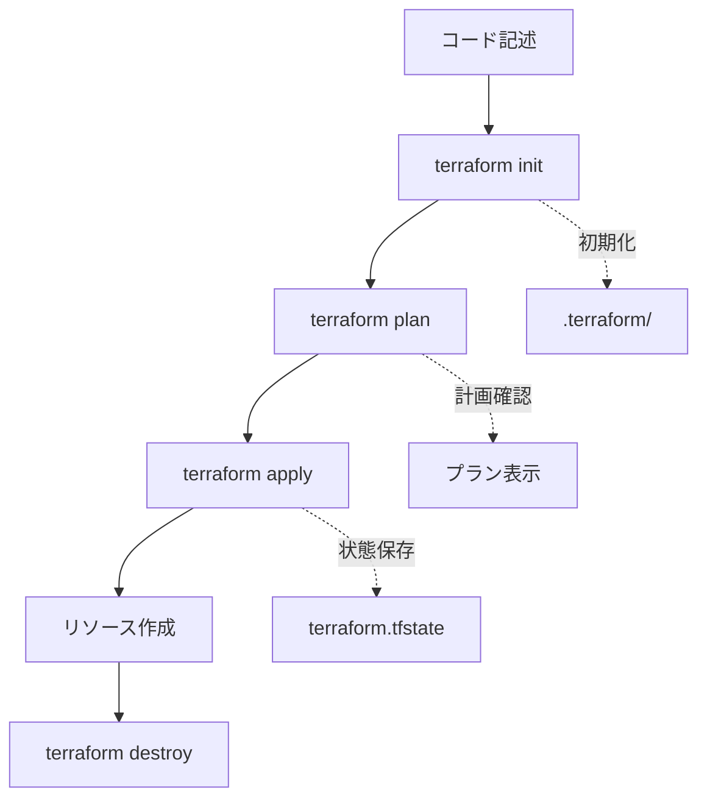

# Terraform 実践ガイド

## 🎯 このガイドの目的

TerraformでAzure Web App環境を構築する手順を学び、Infrastructure as Code（IaC）の基本概念を理解します。

## 📚 学習の流れ

### Phase 1: 環境準備
### Phase 2: Terraform基礎理解  
### Phase 3: Azure リソースの作成
### Phase 4: 運用・管理

---

## Phase 1: 環境準備

### 1.1 必要なツールのインストール

#### Terraform のインストール

**macOS (Homebrew使用)**:
```bash
brew tap hashicorp/tap
brew install hashicorp/tap/terraform

# バージョン確認
terraform version
```

**その他のOS**: [公式インストールガイド](https://learn.hashicorp.com/tutorials/terraform/install-cli)

#### Azure CLI のインストール

**macOS**:
```bash
brew install azure-cli

# バージョン確認
az version
```

### 1.2 Azure認証設定

```bash
# Azureにログイン
az login

# 利用可能なサブスクリプションを確認
az account list --output table

# サブスクリプション設定（複数ある場合）
az account set --subscription "<subscription-name-or-id>"

# 現在の設定確認
az account show
```

---

## Phase 2: Terraform基礎理解

### 2.1 主要概念

#### Provider（プロバイダー）
- クラウドプロバイダー（Azure、AWS等）とのインターフェース
- リソースの作成・管理方法を定義

#### Resource（リソース）
- 実際に作成するインフラコンポーネント
- VM、データベース、ネットワーク等

#### State（状態）
- 現在のインフラ状態をTerraformが追跡
- `terraform.tfstate` ファイルで管理

#### Plan（プラン）
- 実行前に変更内容を確認する機能
- `terraform plan` コマンド

### 2.2 基本ワークフロー



---

## Phase 3: Azure リソースの作成

### 3.1 プロジェクトディレクトリへ移動

```bash
cd infra/environments/dev
```

### 3.2 設定ファイルの準備

```bash
# 設定ファイルをコピー
cp terraform.tfvars.example terraform.tfvars

# エディタで実際の値を設定
vim terraform.tfvars
```

**terraform.tfvars の設定例**:
```hcl
sql_admin_password = "SecureP@ssw0rd123!"
jwt_secret = "your-super-secure-jwt-secret-key-32chars-or-more-12345"
```

### 3.3 Terraform 実行

#### ステップ1: 初期化
```bash
terraform init
```

**何が起こるか**:
- `.terraform/` ディレクトリが作成される
- Azure Provider がダウンロードされる
- バックエンド設定が初期化される

#### ステップ2: プラン確認
```bash
terraform plan
```

**確認ポイント**:
- 作成されるリソース数
- 各リソースの設定内容
- 料金の概算

#### ステップ3: 実行
```bash
terraform apply
```

**実行中の確認**:
- `yes` を入力して実行を承認
- リソース作成の進行状況を確認
- エラーが発生した場合は内容を確認

#### ステップ4: 結果確認
```bash
# 出力値を確認
terraform output

# 特定の出力値のみ表示
terraform output frontend_url
terraform output backend_url
```

### 3.4 Azure Portal での確認

1. [Azure Portal](https://portal.azure.com) にアクセス
2. リソースグループ `rg-webapp-dev` を確認
3. 各リソースの設定を確認:
   - App Service Plan
   - Web Apps (Frontend, Backend)
   - SQL Database
   - Application Insights
   - Storage Account

---

## Phase 4: 運用・管理

### 4.1 リソースの更新

設定を変更してリソースを更新:

```bash
# 設定変更後
terraform plan  # 変更内容を確認
terraform apply # 変更を適用
```

### 4.2 状態管理

```bash
# 現在の状態を表示
terraform show

# 状態をリスト表示
terraform state list

# 特定リソースの詳細表示
terraform state show azurerm_resource_group.main
```

### 4.3 トラブルシューティング

#### よくあるエラーと対処法

**1. リソース名の重複**
```
Error: A resource with the ID "..." already exists
```
→ リソース名を変更するか、既存リソースを削除

**2. 権限不足**
```
Error: Authorization failed
```
→ Azure アカウントの権限を確認

**3. SQL パスワード要件エラー**
```
Error: Password does not meet requirements
```
→ より複雑なパスワードに変更

#### デバッグ方法

```bash
# 詳細ログを有効にする
export TF_LOG=DEBUG
terraform apply

# ログをファイルに保存
export TF_LOG_PATH=./terraform.log
terraform apply
```

### 4.4 コスト管理

#### 料金監視
- Azure Cost Management で料金を定期確認
- アラートを設定して予算超過を防止

#### 不要リソースの削除
```bash
# 全リソースを削除（注意：元に戻せません）
terraform destroy
```

---

## 🎓 学習チェックポイント

各フェーズで以下の理解度をチェック:

### Phase 1 完了チェック
- [ ] Terraform がインストールされている
- [ ] Azure CLI でログインできる
- [ ] サブスクリプションが設定されている

### Phase 2 完了チェック
- [ ] Provider、Resource、State の概念を理解
- [ ] Terraform の基本ワークフローを理解
- [ ] Plan と Apply の違いを理解

### Phase 3 完了チェック
- [ ] terraform init が成功する
- [ ] terraform plan で内容を確認できる
- [ ] terraform apply でリソースが作成される
- [ ] Azure Portal でリソースを確認できる

### Phase 4 完了チェック
- [ ] リソースの更新ができる
- [ ] 状態管理コマンドを使える
- [ ] トラブルシューティングができる
- [ ] terraform destroy でリソースを削除できる

---

## 🚀 次のステップ

### 中級者向け
- [ ] **本番環境の作成**: `infra/environments/prod/` 
- [ ] **モジュール化**: 共通リソースの抽象化
- [ ] **Remote State**: Azure Storage でのState管理
- [ ] **CI/CD統合**: GitHub Actions 連携

### 上級者向け
- [ ] **マルチ環境管理**: Terraform Workspace活用
- [ ] **ポリシー管理**: Azure Policy 統合
- [ ] **シークレット管理**: Azure Key Vault 連携
- [ ] **監視・アラート**: Azure Monitor 自動設定

---

## 📖 参考資料

### 公式ドキュメント
- [Terraform Documentation](https://www.terraform.io/docs)
- [Azure Provider Documentation](https://registry.terraform.io/providers/hashicorp/azurerm/latest/docs)
- [Azure CLI Documentation](https://docs.microsoft.com/cli/azure/)

### 学習リソース
- [HashiCorp Learn](https://learn.hashicorp.com/terraform)
- [Azure Terraform Quick Start](https://docs.microsoft.com/azure/developer/terraform/)
- [Terraform Best Practices](https://www.terraform-best-practices.com/)

### コミュニティ
- [Terraform Community](https://discuss.hashicorp.com/c/terraform-core/27)
- [Azure DevOps Community](https://developercommunity.visualstudio.com/spaces/21/index.html) 